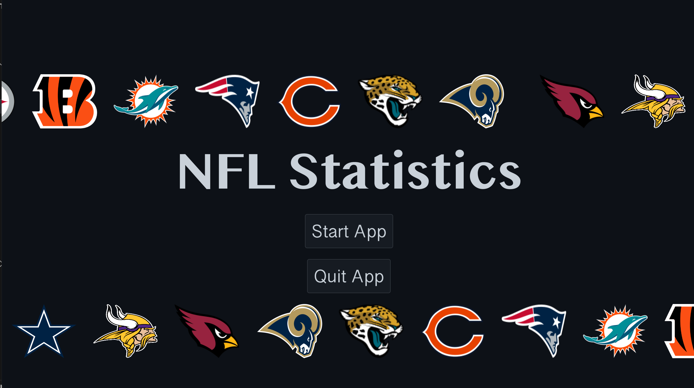
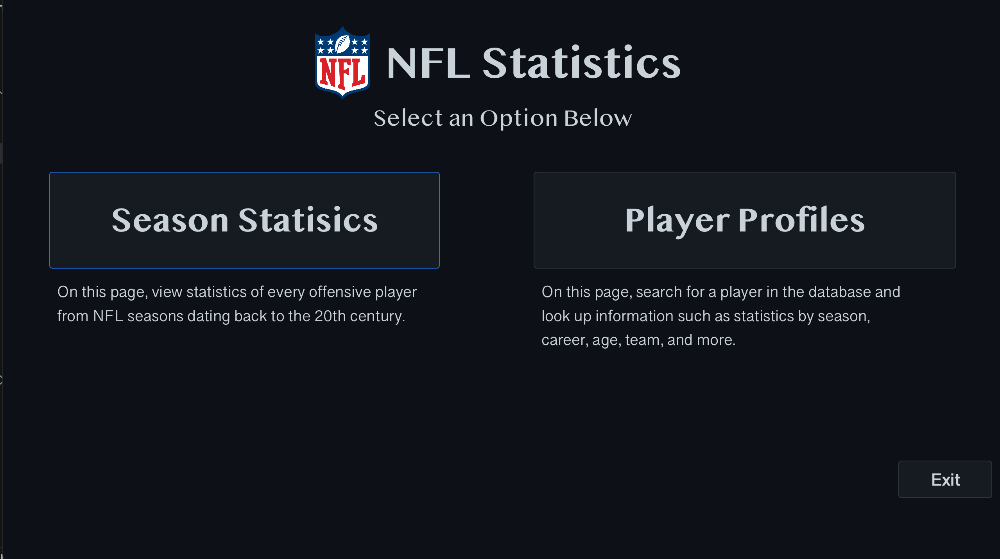
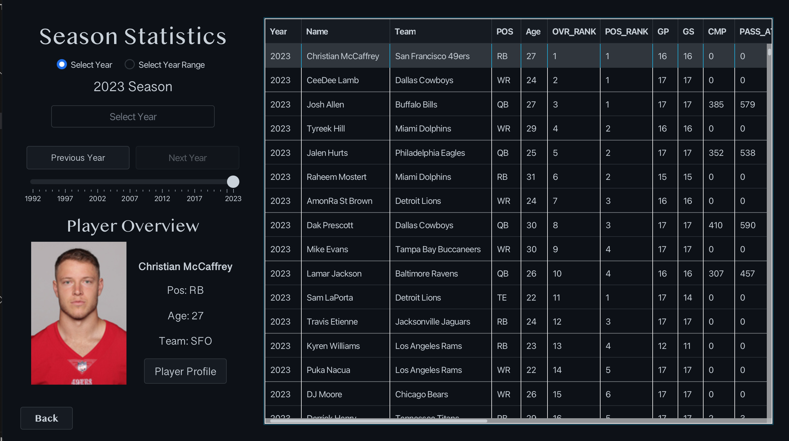
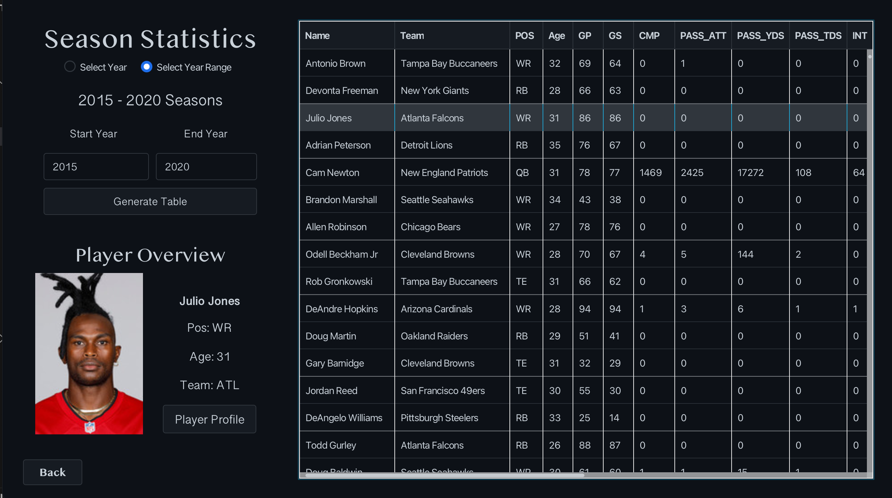
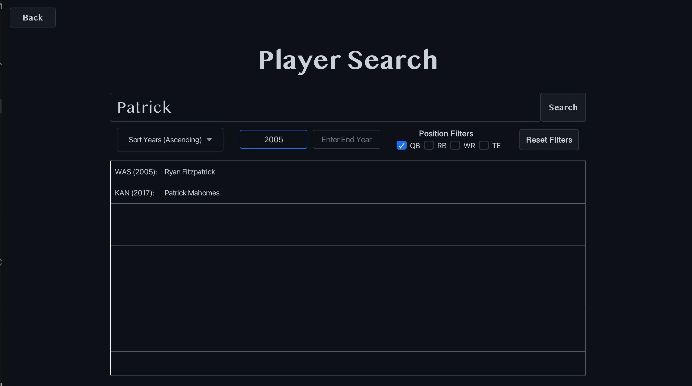
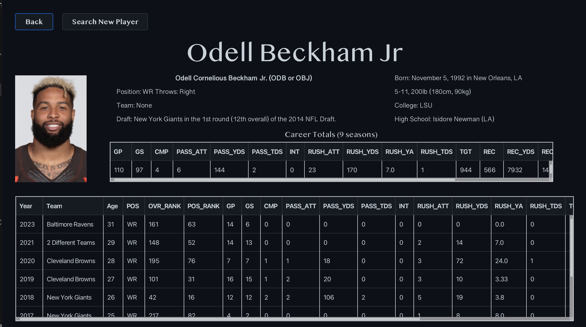

# NFL Statistics Viewer
This application includes [various features](#main-features) to look up information and statistics for NFL offensive players. The data used in this app is manually webscraped from the [Pro Football Reference Website](https://www.pro-football-reference.com/) using `JSoup` libraries. The graphics of the application is powered by `JavaFX` paired with `FXML`. There are various [pages](#application-pages) within the application that display the information in different forms with the use of multiple fxml files.

### Main Features
There are several core features of this application.
- View player statistics dating back to 1992 to current time
- View statistics for all players within a specified year or a range of years
- View headshots of the players with available images
- View summaries of a single player, including all career statistics and extra information (when available)

### Application Pages
Here are the following pages that can be accessed in the application:
- [Start Page](#start-page)
- [Home Page](#home-page)
- [Season Statistics Page](#season-statistics-page)
- [Player Search Page](#player-search-page)
- [Player Profile Page](#player-profile-page)

There will be descriptions of each page of the application below.

#### Start Page

The start page of the application simply includes a decorative animation along with two options. 
- **Quit App** will end the program via `System.exit(0)`. 
- **Start App** will open to the [home page](#home-page) of the application.

#### Home Page

The home page of the application provides two main options depending on what scope of information you want. 
- **Season Statistics** will open to the [season statistics page](#season-statistics-page) of the application.
- **Player Search** will open to the [player search page](#player-search-page) of the application.
- **Exit** will simply take you back to the [start page](#start-page).

#### Season Statistics Page
##### Single Year

##### Year Range

The season statistics page of the application allows you to view the statistics of all players in a specified year or a range of years. The table with data can be sorted according to any stat type, and can scroll both vertically and horizontally.
- **Select Year** will provide you with a set of tools for choosing a [single year](#single-year) to view statistics for. This includes a slider, text field, and a previous and next button.
- **Select Year Range** will provide you with a set of tools for choosing a [year range](#year-range) to view statistics for. This includes a text field for the start year and end year, as well as a generate table button to display the desired table.
- **Player Profile** will take you to the [player profile page](#player-profile-page) of the selected player.
- **Back** will take you back to the [home page](#home-page)

#### Player Search Page

The player search page of the application allows you to search for a player by their name. There is also a set of filters that are provided that you can use to narrow down the search results.
- **Search** will query the data base for the player name you have entered (pressing enter will also do this).
- **Reset Filters** will reset any filter settings that you have modified and display the full results of the search.
- **Back** will take you back to the [home page](#home-page) of the application.

#### Player Profile Page

This page gathers all relevant information about the selected player and displays it. The bottom table has the statistics for the individual years of the player. The smaller table above has the total statistics the player has accumulated over their career. Above this, there are other pieces of information such as height, weight college, etc. that are also pulled from the [Pro Football Reference](https://www.pro-football-reference.com/) website.
- **Back** will take you back to the page that you came from, either the [season statistics page](#season-statistics-page) or the [player search page](#player-search-page).
- **Search New Player** will take you to the [player search page](#player-search-page) to search for a new player.